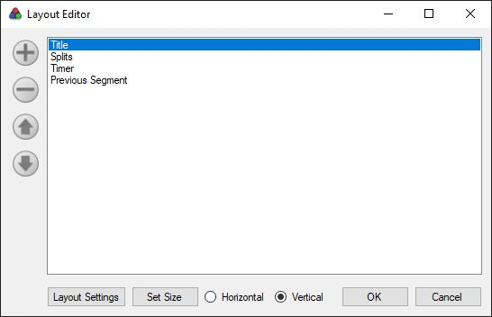
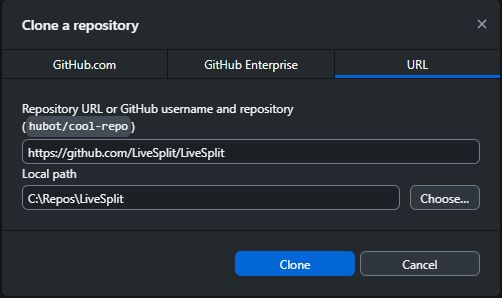
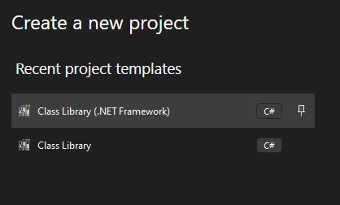
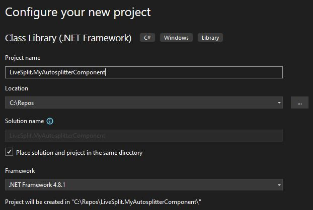
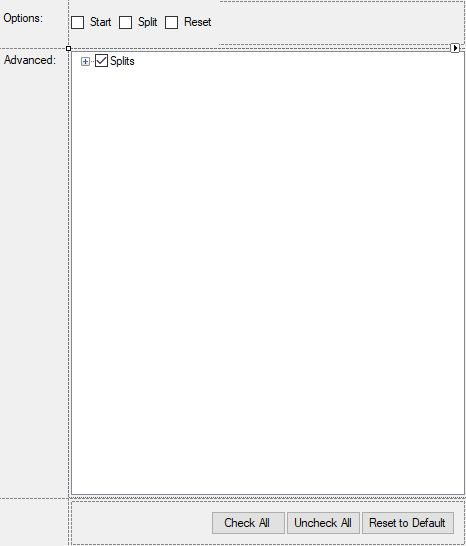
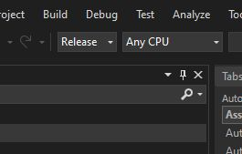
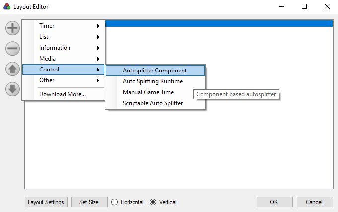

# Building an Autosplitter Component

## What is a component?


Components are .Net modules that plug into LiveSplit, and appear in your layout editor.  Typically they will display something in the main LiveSplit window, but they don't *have* to.<br />
Each component is a .dll file in your LiveSplit\Components folder.  If you look in that folder, you can see components for all the built-in layout elements (Title, Splits, Timer etc.)<br />
Another example of a component is <a href="https://github.com/hawkerm/LiveSplit.ASLVarViewer">ASL Var Viewer</a> which you might have used in previous ASL projects.

### Why use a component instead of an ASL?
Auto Scripting Language is very powerful but does have limitations.  You might want your autosplitter to include a feature which is not available in a conventional ASL, or you might want to add a custom UI to track progress alongside normal splits.  Components can make full use of the .Net framework, and allow you to make your own custom settings dialog.<br>
The <a href="https://github.com/ShootMe/LiveSplit.HollowKnight">Hollow Knight Autosplitter</a> for instance uses customizable sequenced splits, where each split is not monitored until the previous one has been passed.  This allows a runner to (for example) not trigger a "left this region" split before killing that area's boss, even if their route takes them just outside the region for a pickup.<br />
This <a href="https://github.com/TalkTakesTime/LiveSplit.VampireSurvivors">Vampire Survivors Tracker</a> does not autosplit but instead uses the LiveSplit UI to track unlocks.

### Why NOT use a component instead of an ASL?
It takes quite a bit more work to build a component vs an ASL, and of course this means it's that much harder to maintain.  ASL files have some conveniences built in that will not be available when running a component.  You will have no state descriptors, no vars, old/current etc.  You'll either have to build your own code for memory inspection or use LiveSplit's <a href="https://gist.github.com/just-ero/3b07dc98802ba3652cb13ff8313bbfee">undocumented classes and functions</a> to build your splitter logic.  Third party tools like Ero's excellent <a href="https://github.com/just-ero/asl-help">asl-help</a> library most likely cannot be used at all.

### I've used a component autosplitter before and it's not visible in the Layout Editor?
This is a LiveSplit feature.  Any files referenced in the <a href="https://github.com/LiveSplit/LiveSplit.AutoSplitters/blob/master/LiveSplit.AutoSplitters.xml">published list of autosplitters</a> are automatically hidden from the layout editor, and are instead loaded and configured from the Splits Editor.

## What will I need to build a component?

### Things to install
- Visual Studio
    - Visual Studio Community is free to use for any individual developer.  You can find it <a href="https://visualstudio.microsoft.com/vs/community/">here</a>.
- Git
    - Git will be useful for moving code to/from github.  You can either use the command line tools, or download an application such as Github Desktop.
    - Command line tools can be downloaded <a href="https://git-scm.com/downloads/win">here</a>.
    - Github Desktop can be downloaded <a href="https://desktop.github.com/download/">here</a>.

### Initial setup
Start by making an empty folder to work in.  Something like "Repos" would be appropriate.

#### Get the LiveSplit source
We'll need to reference the LiveSplit code when building our component, so let's start by downloading that.

*If you're using git CLI*<br />
Open a command prompt and browse to that folder.  Type:
```
git clone https://github.com/LiveSplit/LiveSplit.git
```

*If you're using Github Desktop*<br />
Use File/Clone Repository, and select the URL tab.  Enter the URL "https://github.com/LiveSplit/LiveSplit".<br />


### Create your project and set up your environment
Open Visual Studio and select "Create a new project"<br />

<br />
**N.B.** Your project should be of the type "Class Library (.NET Framework)" and **NOT** "Class Library" (the other type only supports more recent versions of .Net and will not work with LiveSplit)

<br />
- A common naming convention here is to use "LiveSplit.&lt;*GameName*&gt;"
- I prefer to use the "Place solution and project in the same directory" option here but it's not required
- Use the same .NET Framework version as LiveSplit (4.8.1 at the time this was written; you can find this from the "LiveSplit.Core" project referenced below)

Next, we'll need to add the relevant LiveSplit projects to our solution.  Right click the Solution in Solution Explorer and select "Add -> Existing Project".  Browse into the LiveSplit source folder that we already downloaded, and add the following projects.

- src\LiveSplit.Core\LiveSplit.Core.csproj
- src\UpdateManager\UpdateManager.csproj
- lib\CustomFontDialog\CustomFontDialog\CustomFontDialog.csproj
- lib\SpeedrunComSharp\src\SpeedrunComSharp\SpeedrunComSharp.csproj
- lib\WinForms Color Picker\WinFormsColor\WinFormsColor.csproj

Finally, we need to add the relevant references to our project.  Expand your project in Solution Explorer, then right click references, and add the following:

- Under Assemblies\Framework add:
    - System.Drawing
    - System.Windows.Forms
- Under Projects\Solution add:
    - LiveSplit.Core
    - UpdateManager

## The Code
You'll be writing the component using C# code, which will be familiar if you've already done any work on asl projects.  Unlike in an ASL project however, we'll have full access to C# here and this part of the guide assumes a passing familiarity with some of its concepts and features.  If some of the below doesn't make sense, please consult some more general guides to C# coding for reference.

### Required code elements
The attached project reproduces a conventional ASL structure in a component framework, in order to serve as a learning reference or a starting point for future components.  We'll be referencing parts of the attached project in the examples below.

Your component will need three main elements

- The Component Factory
    - This class defines header information for your component, and directs LiveSplit as to how to create your Component object.
    - This must be referenced in your project's AssemblyInfo to define an entry point.
- The Component
    - This class is the main controller for your module.  All the module's logic is based here.
- The Settings Control
    - This is a Windows Forms User Control, which is what you see when you go to your component's settings in LiveSplit.

### The Component Factory
``UI\Components\AutosplitterComponentFactory.cs``

This class must implement the ``LiveSplit.UI.Components.IComponentFactory`` interface.
```cs
    public class AutosplitterComponentFactory : IComponentFactory
    {
        public string ComponentName => "Autosplitter Component";
        public string Description => "Component based autosplitter";
        public ComponentCategory Category => ComponentCategory.Control;
        public string UpdateName => ComponentName;
        public string XMLURL => String.Empty;
        public string UpdateURL => String.Empty;
        public Version Version => Assembly.GetExecutingAssembly().GetName().Version;
        public IComponent Create(LiveSplitState state) => new AutosplitterComponent(state);
    }
```

The important elements are:
- **ComponentName**: This is the name that is displayed in the Layout Editor
- **Description**: This displays in the tooltip
- **Category**: This defines which submenu the component appears in (Autosplitters typically belong in Control)
- **Create(LiveSplitState state)**: This method is called by LiveSplit to create your Component object

The factory must be referenced in ``Properties\AssemblyInfo.cs`` like this:

```cs
[assembly: ComponentFactory(typeof(AutosplitterComponentFactory))]
```
With "ComponentFactory" being ``LiveSplit.UI.Components.ComponentFactoryAttribute``


### The Component
``UI\Components\AutosplitterComponent.cs``

This class must implement the ``LiveSplit.UI.Components.IComponent`` interface.  This is a relatively large interface, so we'll break this down a bit.

```cs
        public string ComponentName => "Autosplitter Component";

        public float HorizontalWidth => 0;
        public float MinimumHeight => 0;
        public float VerticalHeight => 0;
        public float MinimumWidth => 0;
        public float PaddingTop => 0;
        public float PaddingBottom => 0;
        public float PaddingLeft => 0;
        public float PaddingRight => 0;

        public IDictionary<string, Action> ContextMenuControls => null;
        public void DrawHorizontal(System.Drawing.Graphics g, LiveSplitState state, float height, System.Drawing.Region clipRegion) { }
        public void DrawVertical(System.Drawing.Graphics g, LiveSplitState state, float width, System.Drawing.Region clipRegion) { }
```
All of these properties control parts of the component's UI.  Since we're building a component with no UI, we can set these to 0, null or empty.  UI is beyond the scope of this guide, but if you want to build a component with a UI, you can find more in <a href="https://gist.github.com/TheSoundDefense/cf85fd68ae582faa5f1cc95f18bba4ec">this tutorial</a> or check out some practical examples, such as the Vampire Survivors tracker linked above.

```cs
        public XmlNode GetSettings(XmlDocument document)
        {
            if (Settings == null) throw new NullReferenceException("Settings control is not initialised");
            return Settings.GetSettings(document);
        }

        public Control GetSettingsControl(LayoutMode mode)
        {
            Settings.Mode = mode;
            return Settings;
        }

        public void SetSettings(XmlNode settings)
        {
            if (Settings == null) throw new NullReferenceException("Settings control is not initialised");
            Settings.SetSettings(settings);
        }
```
These methods reference the Settings Control, which we'll get into later.

- **GetSettingsControl(LayoutMode mode)**: This method is called by LiveSplit to retrieve the Settings Control.  It passes through the current layout mode (which we can safely ignore as we have no UI)
- **GetSettings(XmlDocument document)**: This method collects all our settings in Xml format (in order to save them).  In our example we just pass this through to the Settings Control.
- **SetSettings(XmlNode settings)**: This method updates our control from the saved Xml.  Again, we've just passed this through to the control.

```cs
        public AutosplitterComponent(LiveSplitState state)
        {
            State = state;
            Timer = new TimerModel() { CurrentState = state };
            Settings = new AutosplitterSettings();

            Game.Name = "Your game goes here";

            State.OnStart += StartEvent;
            State.OnReset += ResetEvent;
            Timer.OnSplit += SplitEvent;
            Game.OnHook += HookEvent;
            Game.OnClose += CloseEvent;
            Startup();
        }
```
This constructor is called by LiveSplit when the component is initialized.  You can see here that alongside our Settings Control, we store LiveSplit's State object, as well as a TimerModel.  Most if not all ASL capabilities can be achieved via these objects.  For example, we can see the OnStart, OnReset and OnSplit events being bound here. We can also see some references to Game; this is not LiveSplit functionality, but a custom process wrapper which can be found at ``Memory\Game.cs``.  Finally we call the ASL Startup method at this point.

```cs
        public void Update(IInvalidator invalidator, LiveSplitState state, float width, float height, LayoutMode mode)
        {
            if (Game.Process == null) return;
            if (!Initialized) return;

            if (!Update()) return;
            if (Timer.CurrentState.CurrentPhase == TimerPhase.Running)
            {
                Timer.CurrentState.IsGameTimePaused = IsLoading();
                Timer.CurrentState.SetGameTime(GameTime());
                if (Settings.Reset && Reset()) Timer.Reset();
                else if (Settings.Split && Split()) Timer.Split();
            }
            else if (Settings.Start && Start()) Timer.Start();
        }
```
This method is called continuously on a rapid loop.  Most of the variables are UI related, and we already have the state object, so we won't need these.  Again here we're largely just reproducing ASL functions; we can see some mappings of ASL concepts to the TimerModel object:

- **IsLoading**: ``Timer.CurrentState.IsGameTimePaused``
- **GameTime**: ``Timer.CurrentState.SetGameTime()``
- **Start**: ``Timer.Start()``
- **Split**: ``Timer.Split()``
- **Reset**: ``Timer.Reset()``

### The Settings Control
``UI\Components\AutosplitterSettings.cs``<br />


This is a standard User Control (Windows Forms).  Since it does not scale to fit the settings dialog, we need to size it manually. With a bit of trial and error, it appears that **470x550** is about the right size.  It has no specific requirements, but since we passed through the GetSettings and SetSettings methods from the Component earlier, we'll need to implement them here.  As a reminder GetSettings collects the settings from the form and formats them as an XmlDocument, while SetSettings reads in an XmlNode and applies the settings to the form.

```cs
        public XmlNode GetSettings(XmlDocument document)
        {
            XmlElement settings = document.CreateElement("Settings");

            settings.AppendChild(GetSetting(document, "Start", cbxStart));
            settings.AppendChild(GetSetting(document, "Split", cbxSplit));
            settings.AppendChild(GetSetting(document, "Reset", cbxReset));

            settings.AppendChild(GetSetting(document, "Settings", tvwSettings));

            return settings;
        }

        private XmlElement GetSetting(XmlDocument document, string name, CheckBox control)
        {
            var element = document.CreateElement(name ?? control.Name);
            element.SetAttribute("Value", control.Checked.ToString());
            return element;
        }

        private XmlElement GetSetting(XmlDocument document, string name, TreeView control)
        {
            var element = document.CreateElement(name ?? control.Name);
            foreach(TreeNode node in GetAllNodes(control))
            {
                element.AppendChild(GetSetting(document, node.Name, node));
            }
            return element;
        }

        private XmlElement GetSetting(XmlDocument document, string name, TreeNode control)
        {
            var element = document.CreateElement(name ?? control.Name);
            element.SetAttribute("Value", control.Checked.ToString());
            return element;
        }
```

```cs
        public void SetSettings(XmlNode settings)
        {
            SuspendLayout();

            SetSetting(settings.SelectSingleNode(".//Start"), cbxStart);
            SetSetting(settings.SelectSingleNode(".//Split"), cbxSplit);
            SetSetting(settings.SelectSingleNode(".//Reset"), cbxReset);

            SetSetting(settings.SelectSingleNode(".//Settings"), tvwSettings);

            ResumeLayout(true);
        }

        private void SetSetting(XmlNode setting, CheckBox control)
        {
            control.Checked = false;
            if (!bool.TryParse(setting.Attributes["Value"].Value, out var value)) return;
            control.Checked = value;
        }

        private void SetSetting(XmlNode setting, TreeView control)
        {
            foreach (TreeNode node in GetAllNodes(control))
            {
                SetSetting(setting.SelectSingleNode(".//" + node.Name), node);
            }
        }

        private void SetSetting(XmlNode setting, TreeNode control)
        {
            control.Checked = false;
            if (!bool.TryParse(setting.Attributes["Value"].Value, out var value)) return;
            control.Checked = value;
        }
```

## Building and Testing the component


<br />
You can set a solution configuration using the dropdown above. Since we can't easily run this code in a debug context, it's simplest to leave this at "Release".  To build the software, select "Build Solution" from the build menu.  This will output several files into the project folder under either "bin/Debug" or "bin/Release" depending on the configuration you choose.  The only file you will need will be the .dll file produced by your product (the filename will match your project's name).  Take this and drop it into your LiveSplit Components folder, then start up LiveSplit.

<br />
Edit your layout, and add your component:



### Testing and Debugging
Since conventional debugging is difficult to achieve we can instead send messages to the debug log in similar fashion to print() statements in a regular ASL script, but in a component we need to use ``System.Diagnostics.Trace.WriteLine(string message)`` to send these messages.  In our sample code, we've wrapped this function in a static method under Utility.

```cs
        public static void Log(object value)
        {
            if (value == null) value = String.Empty;
            Trace.WriteLine(value.ToString());
        }
```

## Good luck!
That's about all the basics, or at least all I've managed to figure out so far.  Hopefully this is of some use to you, and good luck developing your autosplitter component!